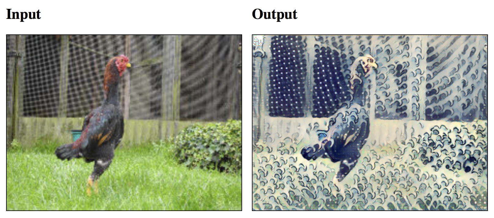

# Neural Style Transfer
Example of [Neural Style Transfer [Johnson+, 2016]](https://arxiv.org/abs/1603.08155) with [WebDNN](https://github.com/mil-tokyo/webdnn)



You can download pre-trained model from
- [yusuketomoto/chainer-fast-neuralstyle](https://github.com/yusuketomoto/chainer-fast-neuralstyle)
- [gafr/chainer-fast-neuralstyle-models](https://github.com/gafr/chainer-fast-neuralstyle-models)

## How to Run

1. Install WebDNN [(see document)](https://mil-tokyo.github.io/webdnn/docs/tutorial/setup.html)

2. Clone [gafr/chainer-fast-neuralstyle-models](https://github.com/gafr/chainer-fast-neuralstyle-models) at root directory of this repository.
    Note: Download of about 200MB model is needed.
    
    ```bash
    $ git clone https://github.com/gafr/chainer-fast-neuralstyle-models
    ```
    
3. Convert model

    ```bash
    $ python convert.py --model kanagawa --backend webgpu
    ```

    `--model` option selects the style. For details, see `python convert.py -h`
    
3. Access to `index.html` with your browser

## Note

This example use **Placeholder** feature in WebDNN, which supports specifying tensor shape at runtime. **However, only WebGPU and WebAssembly backend supports this feature and WebGL backend does NOT support.**

## License

MIT License, 2017, Yuichiro Kikura<y.kikura@gmail.com>